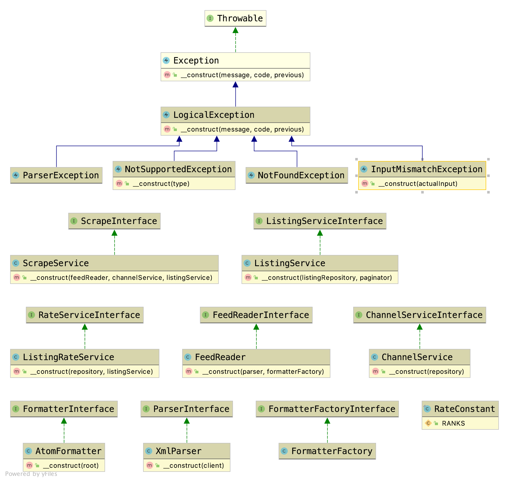

### Class diagram

## Installation
- First time `make first`
- Up after first time `make up`

## Run test cases
- Run `make test`

### Scrape new feeds
- GET `http://localhost:8001/feeds`
### List scrapped listings/feeds
- GET `http://localhost:8001/listings`

### Built With
* [PHP7.4](http://php.net)
* [Symfony5](http://www.symfony.com) 
